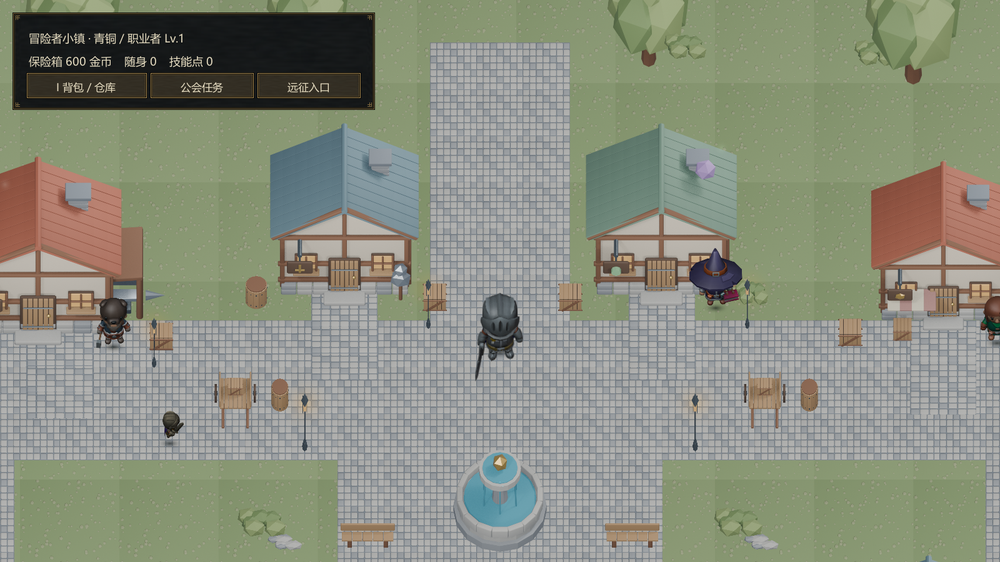
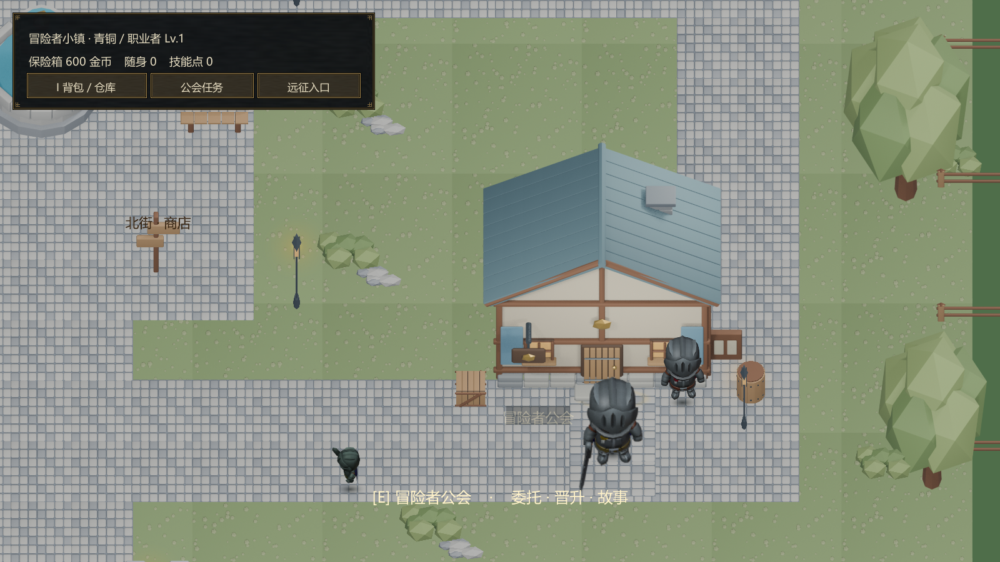
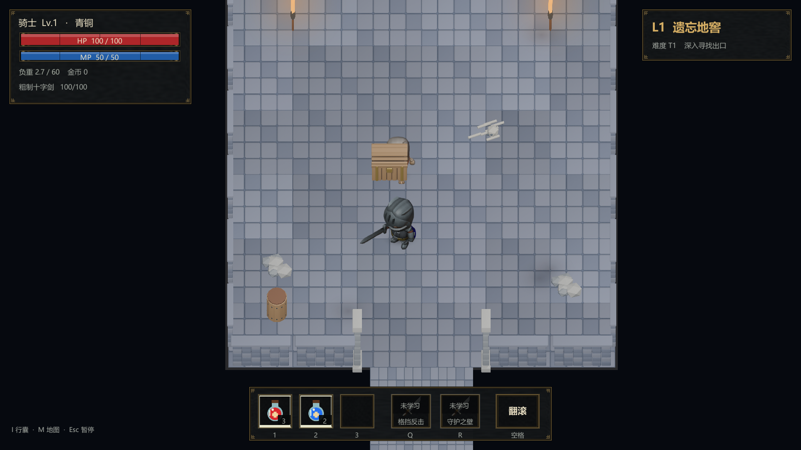
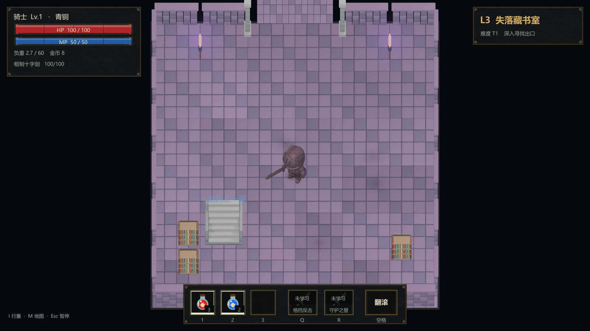
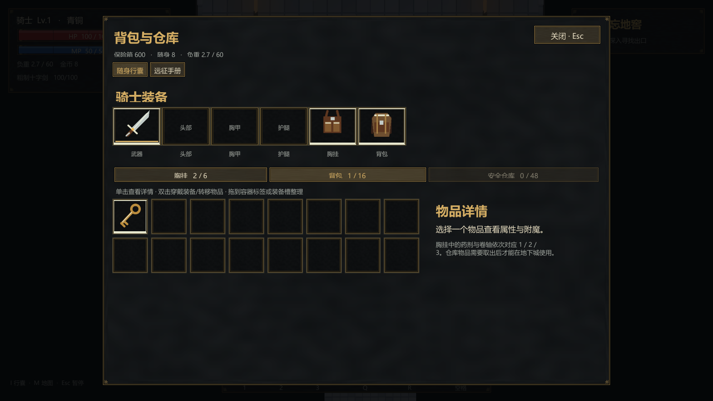
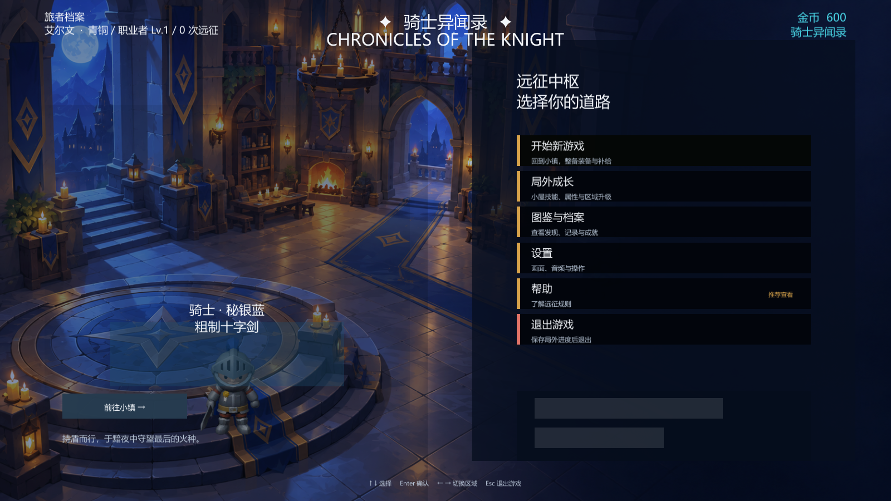

# 建模与美术升级 · ART-001

本轮保持 Unity 2022.3.62f1 / 2.5D 预渲染路线，把场景色块替换为真实三维建模烘焙美术。小镇和地下城已实际接入；以下预览由 Windows 构建产物读取独立测试档案后生成，不是概念图或美术联系表。

## 实际游戏画面

北街包含防具店、药剂店和两侧店铺；公会近景展示门侧商户、告示栏、路灯与可达入口。地下城展示砌石、楼梯、火盆、可搜索容器及不同楼层配色。背包显示实际装备、容量、物品图标与品质边框。

完整捕获输出和运行日志位于 `.work/art-review`；最终捕获、运行检查和包校验结果见 [任务入口](../TASK_STATUS.md)。

最新构建 15 幅 1600×900 画面捕获与运行检查通过，每幅功能界面实际执行原生 IMGUI Layout/Repaint；首页菜单通过真实 UGUI 相机模式捕获。隐藏窗口不能代表系统鼠标人工验收，本轮没有用未经支持的输入注入结果宣称拖拽通过。

## 可编辑产物

- [模型与重现说明](../assets/models/world/README.md)：35 项世界模型（1974 网格部件）及单独侧墙变体，四商户源模型、骑士与四类骷髅带动作源文件。
- [世界素材联系表](../assets/models/world/qa/world-contact-sheet.png)、[角色方向联系表](../assets/models/world/qa/character-directions-contact-sheet.png)、[动作帧联系表](../assets/models/world/qa/character-motion-contact-sheet.png)。这些为资产 QA，不代替游戏截图。
- 7 幅骑士与 12 幅骷髅图集，共 1136 帧。修复历史图集八行同向、动作裁边及引擎NPOT缩放，按取景元数据归一角色尺寸。

场景建筑/道具为本轮原创网格与材质；人物骨骼和基础动作源自项目已有 KayKit CC0 包，保留原许可。图标按装备类别与档位制作，尚未为 625 件装备逐件建模。音频、人工体验、全部敌人外观和性能验收限制见 [交付边界](PLAYABLE_RELEASE.md)。
